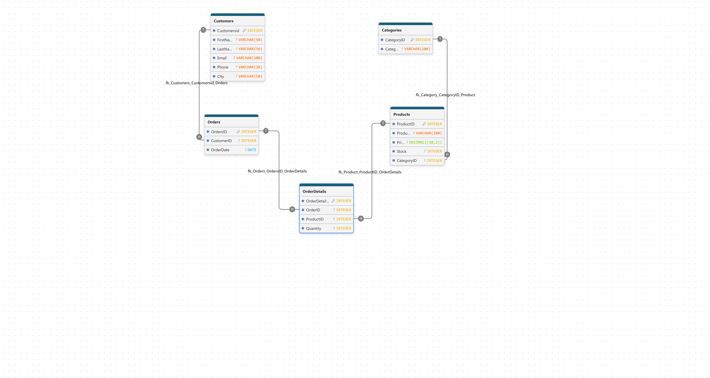

# 🛒 Retail Sales SQL Project

A relational database project built using **MySQL** to simulate a retail sales management system. This project demonstrates database design, SQL development, data relationships, and business reporting through advanced SQL queries.

---

## 📌 Project Overview

The Retail Sales SQL Project was developed to demonstrate practical database design and SQL programming skills. It includes creating a relational database, establishing table relationships, inserting sample data, and generating business reports using SQL.

---

## ✨ Features

- Relational Database Design
- Primary Keys & Foreign Keys
- One-to-Many Relationships
- Sample Retail Sales Dataset
- SQL JOIN Queries
- Aggregate Functions (SUM, AVG, COUNT)
- SQL Views
- Stored Procedures
- Triggers
- Indexes
- Entity Relationship Diagram (ERD)

---

## 🗂 Database Structure

The database consists of five related tables:

- Customers
- Categories
- Products
- Orders
- OrderDetails

---

## 📊 Business Reports

The project includes several analytical SQL queries such as:

- Sales Report
- Total Sales by Product
- Top Customers
- Average Product Price
- Most Expensive Product
- Low Stock Products
- Total Orders per Customer

---

## 🛠 Technologies Used

- MySQL
- MySQL Workbench
- SQL

---

## 📁 Project Structure

```text
Retail-Sales-SQL-Project/
│
├── README.md
├── retail_sales.sql
├── queries.sql
├── ERD.png
│
└── screenshots/
    ├── Database_Tables.png
    ├── Sales_Report.png
    └── View_Result.png
```

---

## 🖼 Database ER Diagram



---

## 📸 Project Screenshots

### Database Tables


### Sales Report


### Sales View


---

## 🚀 How to Run

1. Open MySQL Workbench.
2. Execute `retail_sales.sql` to create the database and insert the sample data.
3. Execute `queries.sql` to run the analytical SQL queries.

---

## 🎯 Learning Outcomes

This project demonstrates practical experience with:

- Relational Database Design
- SQL Programming
- Database Normalization
- Data Analysis Using SQL
- Database Objects (Views, Procedures, Triggers)
- Business Reporting

---

## 👩‍💻 Author

**Wafa Shujaa**

Computer Science Graduate | Master's Student in Computer Science